### DVWA

## Brute Force

# Hydra

```bash
hydra -l admin -P /usr/share/wordlists/rockyou.txt "http-get-form://172.17.0.2/vulnerabilities/brute/:username=^USER^&password=^PASS^&Login=submit:Username and/or password incorrect."
```

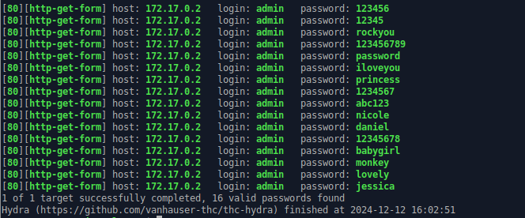

# SQL Inyection

`admin '#`

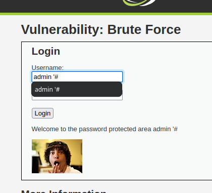

## Command Injection

`8.8.8.8 | cat /etc/passwd`

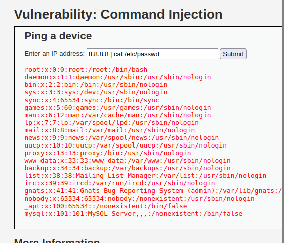

## CSFR

Podemos cambiar directamente la contraseña desde la URL.

http://172.17.0.2/vulnerabilities/csrf/?password_new=sapo&password_conf=sapo&Change=Change#

## XSS

Escribimos un artículo y luego damos clic en "Sign guestbook". Luego, vamos a inspeccionar, buscamos el post, lo editamos y lo enviamos. Aquí cambiamos la contraseña.

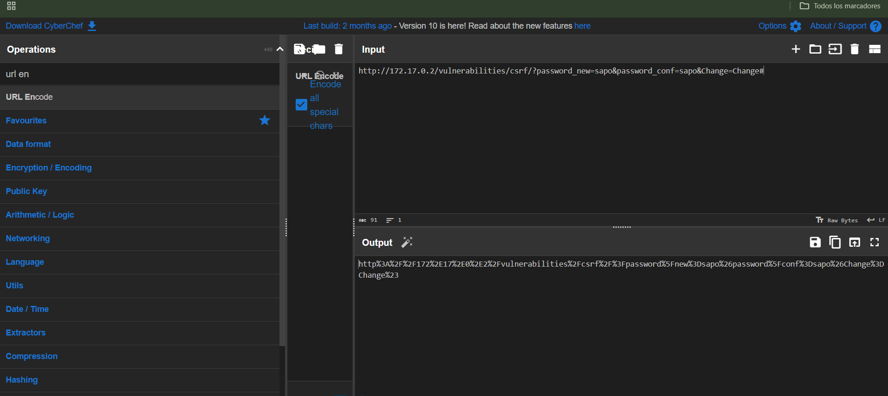

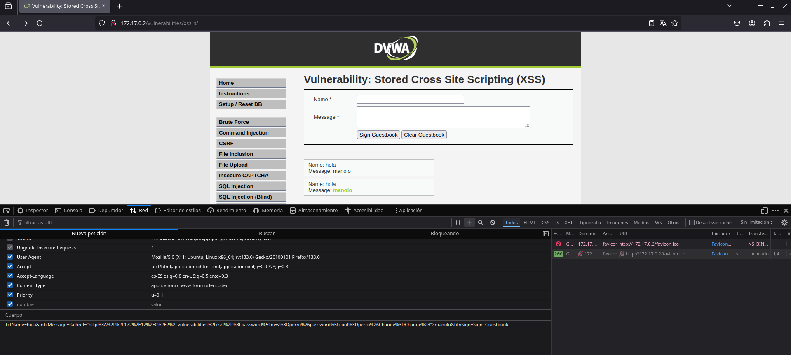

## SQL INJECTION

El primer paso consiste en verificar si al inyectar una comilla simple ('), la aplicación devuelve un error. Una vez que se haya producido dicho error, podemos confirmar que la comilla simple (') es interpretada correctamente por el sistema.

El siguiente paso sería inyectar la cadena -1' OR '1'='1, lo cual engaña a la base de datos, haciendo que interprete la consulta como verdadera. Esto nos permite obtener los valores de la tabla "users".

Posteriormente, inyectamos la cadena -1' UNION SELECT null, table_name FROM information_schema.tables WHERE table_schema=database()--, lo que nos permite visualizar todas las tablas de la base de datos. Esto ocurre porque el campo "User ID" es vulnerable a inyección SQL, lo que implica que los datos ingresados por el usuario no están adecuadamente filtrados ni validados. Al insertar esta cadena, se altera la consulta original y se combina con otra consulta que recupera la lista de todas las tablas de la base de datos.

El uso de la cláusula UNION permite combinar los resultados de distintas consultas, y la vista information_schema proporciona los metadatos de la base de datos, lo que facilita el acceso a información sensible de la estructura de la misma.

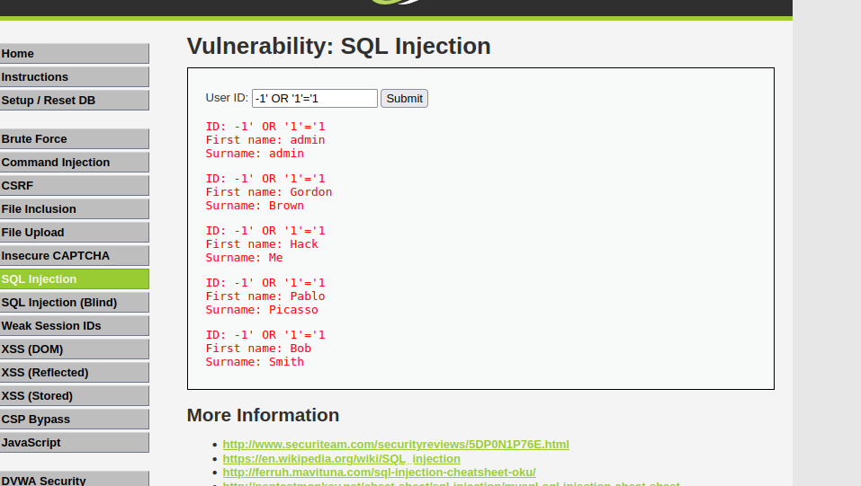

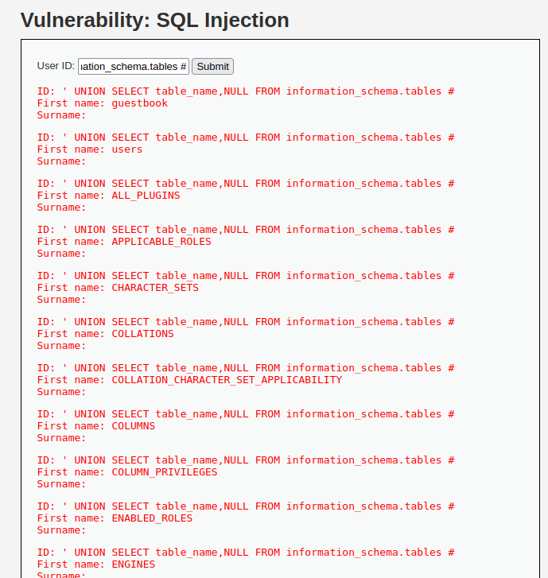

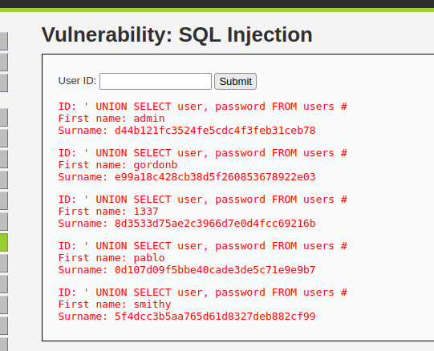

## FILE UPLOAD

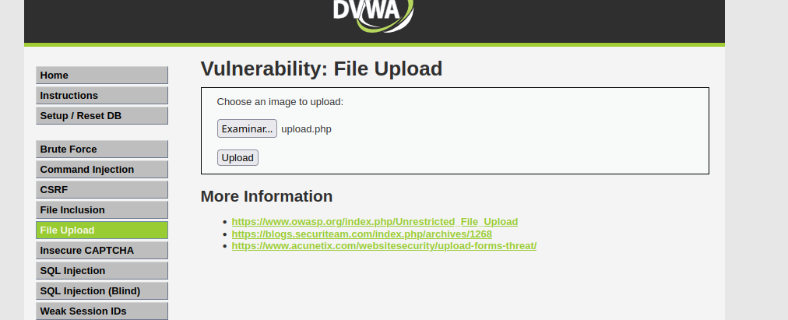

Creamos un php.info

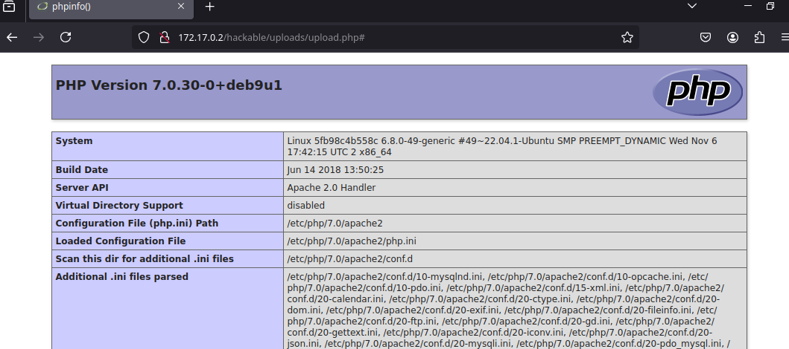

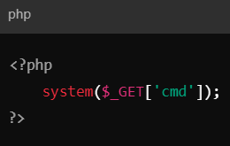

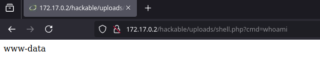

